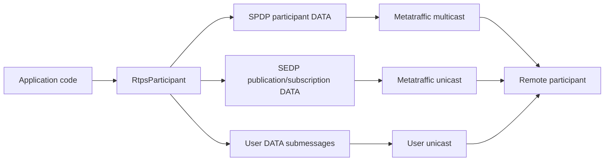
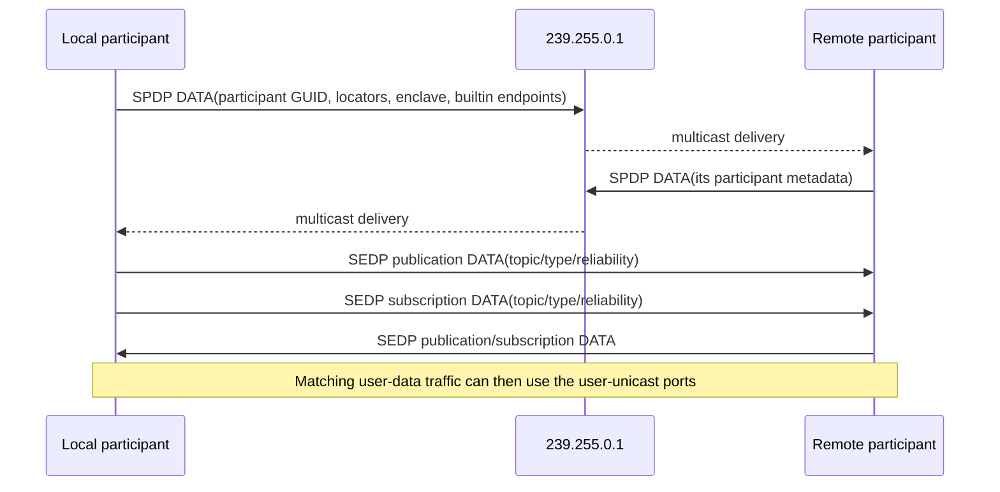

# RTPS Component

The `RtpsParticipant` component is the beginning of a cross-platform RTPS
(Real-Time Publish-Subscribe) implementation built on top of the ESPP `socket`
component.

This component now includes the first real RTPS discovery slice:

- RTPS header and DATA submessage framing helpers
- standard RTPS UDPv4 port calculations
- GUID, entity ID, locator, and sequence number utility types
- SPDP participant announcements using PL_CDR parameter lists
- SEDP publication and subscription announcements for local endpoints
- parsing and tracking of discovered remote participants, writers, and readers
- integration with the shared `cdr` component for CDR/PL_CDR payload handling

The long-term goal for this component is DDS/RTPS interoperability with ROS 2
nodes, including best-effort and reliable user-data flows. Discovery is now
standards-shaped, but the reliable RTPS state machines (`HEARTBEAT`,
`ACKNACK`, resend windows) and ROS 2 endpoint/user-data interoperability are
still incomplete.

## How RTPS Works

RTPS separates *metatraffic* from *user traffic*.

- **Metatraffic** carries discovery and endpoint metadata. In this component,
  that means SPDP participant announcements plus SEDP publication and
  subscription announcements.
- **User traffic** carries application samples. The current ESPP scaffold has a
  temporary best-effort `UInt32` user-data path while the standards-based
  ROS 2 data plane is still being completed.

The current `RtpsParticipant` implementation opens three UDP sockets when
`start()` is called:

1. metatraffic multicast receive on the well-known SPDP multicast port
2. metatraffic unicast receive on the participant-specific discovery port
3. user unicast receive on the participant-specific user-data port

It then starts a periodic announce task which multicasts SPDP and unicasts SEDP
endpoint announcements to each discovered peer.

## Discovery Flow

At a high level, discovery proceeds like this:

## Expected Compatibility

The table below is intentionally conservative: **expected** means "this is the
intended scope based on the current wire format and code", not "fully verified
against every stack".

| Peer implementation | Expected compatibility | Notes |
| --- | --- | --- |
| ESPP `rtps` component / `python/rtps_host.py` | **Yes** for current scaffold | Intended smoke-test path for SPDP, SEDP, and the temporary `UInt32` `ESPPDATA` user-data payload. |
| Generic DDSI-RTPS 2.3 implementations | **Partial** | SPDP and SEDP messages are standards-shaped, but only the discovery slice is implemented today. |
| ROS 2 nodes backed by Fast DDS | **Partial / discovery-targeted** | The current discovery messages include ROS 2-relevant participant user data such as `enclave=...;`, but standards-based ROS 2 topic data exchange is not finished yet. |
| ROS 2 nodes backed by Cyclone DDS or other DDS vendors | **Partial / unverified** | Expected to be limited to the minimal discovery subset if the peer accepts the currently emitted parameter set; not validated yet. |
| Reliable DDS/RTPS endpoints | **No** | `HEARTBEAT`, `ACKNACK`, retransmission windows, and other reliable state-machine pieces are not implemented. |

## Feature Status

| Feature | Status | Notes |
| --- | --- | --- |
| RTPS header / DATA submessage serialize + parse | **Implemented** | Core message framing is present. |
| Standard UDPv4 RTPS port mapping | **Implemented** | Uses the DDSI-RTPS well-known port formula. |
| SPDP participant announce send/receive | **Implemented** | Multicast announce plus participant cache updates. |
| SEDP publication / subscription announce send/receive | **Implemented** | Local endpoints are announced and remote endpoints are cached. |
| Participant / endpoint discovery callbacks | **Implemented** | Exposed through `on_participant_discovered` and `on_endpoint_discovered`. |
| Temporary `UInt32` user-data path | **Implemented** | Uses the current ESPP-specific `ESPPDATA` payload, not a standards-based DDS sample representation. |
| QoS fields emitted in discovery | **Partial** | Reliability, durability, liveliness, and history parameters are advertised in SEDP. |
| QoS matching / policy enforcement | **Not implemented** | Remote QoS is parsed, but full writer/reader matching logic is still missing. |
| Standards-based DDS user-data serialization | **Not implemented** | The current data path is a temporary ESPP scaffold for `std_msgs/msg/UInt32`. |
| Inline QoS handling | **Not implemented** | Discovery and user-data handling assume no inline QoS. |
| Reliable RTPS (`HEARTBEAT`, `ACKNACK`, resend`) | **Not implemented** | Reliable delivery is not interoperable yet. |
| Full ROS 2 topic interoperability | **Not implemented** | Discovery is the current milestone; ROS 2-compatible data writers/readers are still pending. |

## Example

The [example](./example) exercises the protocol helpers, computes the standard
RTPS ports, builds/parses SPDP and SEDP messages, and demonstrates the
participant API without requiring a second device.
