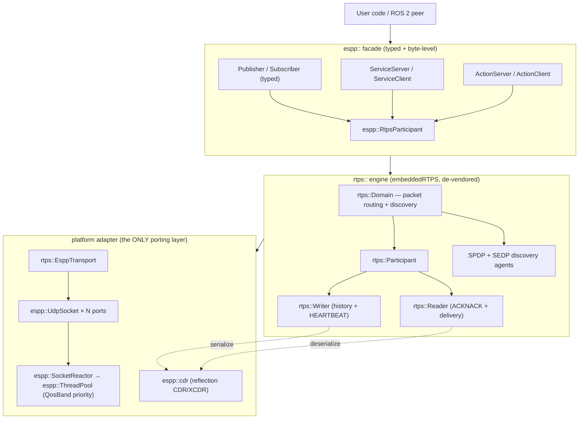
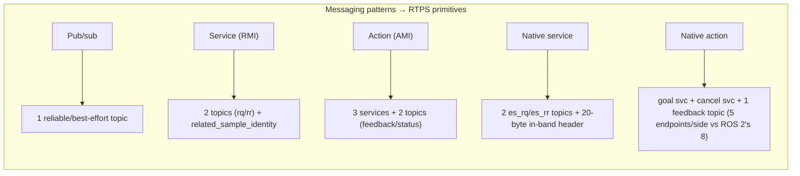

# RTPS

[](https://components.espressif.com/components/espp/rtps)

ESPP component that integrates the [embeddedRTPS](https://github.com/embedded-software-laboratory/embeddedRTPS)
RTPS/DDS stack into the ESPP ecosystem, behind an idiomatic `espp::RtpsParticipant`
facade. Any platform that can build ESPP — ESP32, Linux, macOS, Windows — can use
it to interoperate with **ROS 2** nodes (rmw_fastrtps) or any DDS participant on
the network over the standard RTPS wire protocol.

It provides three messaging patterns, all validated against live ROS 2 (Jazzy):

- **Pub/sub** — topic-based, best-effort or reliable (HEARTBEAT/ACKNACK).
- **Services (RMI)** — request/reply with correlated responses.
- **Actions (AMI)** — long-running goals with feedback, result, and cancellation.

Each has a **typed** layer (reflectable structs, no manual bytes) and a
**byte-level** layer. Services and actions come in a ROS 2-interoperable flavour
and a lean **native** (espp ↔ espp) flavour.

The upstream embeddedRTPS library hard-depends on FreeRTOS and lwIP; this
component removes those by routing all socket, task, and synchronisation through
ESPP's platform-agnostic `UdpSocket`, `Task`, `ThreadPool`, and `SocketReactor`.
On ESP32 those map to lwIP + FreeRTOS; elsewhere to the host OS. Micro-CDR is
gone — (de)serialization uses ESPP's reflection-driven `cdr`.

> **History:** this component was developed as `rtps_embedded` alongside an
> earlier from-scratch `rtps`; it is now the single `rtps` component. See
> [`REFACTOR_PLAN.md`](REFACTOR_PLAN.md) and [`RMI_AMI_DESIGN.md`](RMI_AMI_DESIGN.md).

---

## Architecture

The only platform-specific code is `EsppTransport`; everything above it is
portable C++23. The `espp::` facade is a thin, typed surface over the `rtps::`
engine.


```mermaid
flowchart TD
    U["User code / ROS 2 peer"]

    subgraph facade["espp:: facade (typed + byte-level)"]
        direction TB
        PS["Publisher / Subscriber (typed)"]
        SVC["ServiceServer / ServiceClient"]
        ACT["ActionServer / ActionClient"]
        RP["espp::RtpsParticipant"]
        PS --> RP
        SVC --> RP
        ACT --> RP
    end

    subgraph engine["rtps:: engine (embeddedRTPS, de-vendored)"]
        direction TB
        DOM["rtps::Domain — packet routing + discovery"]
        PART["rtps::Participant"]
        WR["rtps::Writer (history + HEARTBEAT)"]
        RD["rtps::Reader (ACKNACK + delivery)"]
        DISC["SPDP + SEDP discovery agents"]
        DOM --> PART --> WR & RD
        DOM --> DISC
    end

    subgraph plat["platform adapter (the ONLY porting layer)"]
        direction TB
        TR["rtps::EsppTransport"]
        SOCK["espp::UdpSocket × N ports"]
        REACT["espp::SocketReactor → espp::ThreadPool (QosBand priority)"]
        CDR["espp::cdr (reflection CDR/XCDR)"]
        TR --> SOCK --> REACT
    end

    U --> facade --> engine --> plat
    WR -. serialize .-> CDR
    RD -. deserialize .-> CDR
```

| Build target | Socket backend | Task backend |
|---|---|---|
| ESP32 | lwIP (via ESP-IDF) | FreeRTOS |
| Linux / macOS / PC | POSIX sockets | `std::thread` |

Services and actions are **pure library code** over pub/sub — the only wire
addition is a `related_sample_identity` inline QoS on service request/reply (for
ROS 2 correlation). Actions add no wire primitive at all: they compose services
and topics.


```mermaid
flowchart LR
    subgraph patterns["Messaging patterns → RTPS primitives"]
        direction TB
        P1["Pub/sub"] --> W1["1 reliable/best-effort topic"]
        P2["Service (RMI)"] --> W2["2 topics (rq/rr) + related_sample_identity"]
        P3["Action (AMI)"] --> W3["3 services + 2 topics (feedback/status)"]
        P4["Native service"] --> W4["2 es_rq/es_rr topics + 20-byte in-band header"]
        P5["Native action"] --> W5["goal svc + cancel svc + 1 feedback topic (5 endpoints/side vs ROS 2's 8)"]
    end
```

---

## Quick-start (typed facade)

```cpp
#include "rtps_participant.hpp"
#include "rtps_pubsub.hpp"   // typed Publisher<T> / Subscriber<T>
#include "rtps_service.hpp"  // typed ServiceServer / ServiceClient
#include "rtps_action.hpp"   // typed ActionServer  / ActionClient

// Any reflectable struct is a message - fields map straight to CDR.
struct StringMsg  { std::string data; };
struct AddReq     { int64_t a, b; };
struct AddResp    { int64_t sum; };

espp::RtpsParticipant participant({.interface_address = "192.168.1.10"});
participant.start();

// Pub/sub
espp::Publisher<StringMsg>  pub(participant, {.topic = "rt/chatter",
                                              .type_name = "std_msgs::msg::dds_::String_",
                                              .reliability = espp::RtpsParticipant::Reliability::RELIABLE});
espp::Subscriber<StringMsg> sub(participant, {.topic = "rt/chatter",
                                              .type_name = "std_msgs::msg::dds_::String_",
                                              .on_message = [](const StringMsg &m) { /* use m.data */ }});
pub.publish(StringMsg{"hello"});

// Service (RMI) - ros2 service call /add_two_ints ... hits this server
espp::ServiceServer<AddReq, AddResp> server(participant, {
    .service = "/add_two_ints", .type_name = "example_interfaces::srv::dds_::AddTwoInts",
    .handler = [](const AddReq &r) { return AddResp{r.a + r.b}; }});
espp::ServiceClient<AddReq, AddResp> client(participant, {
    .service = "/add_two_ints", .type_name = "example_interfaces::srv::dds_::AddTwoInts"});
if (auto resp = client.call(AddReq{7, 35}, std::chrono::seconds(1))) { /* resp->sum == 42 */ }
```

For ROS 2 interop use ROS 2 naming: topic `rt/<name>`, type `<pkg>::msg::dds_::<Type>_`.
The full request/reply + goal APIs (including the three client call styles and the
native protocol) are documented in
[`doc/en/protocols/rtps_rmi_ami.rst`](../../doc/en/protocols/rtps_rmi_ami.rst).

### Byte-level API

The typed wrappers are thin layers over `espp::RtpsParticipant`'s byte-level
methods (`add_writer`/`add_reader`/`publish`, `add_service_server`/`_client`,
`add_action_server`/`_client`, and the `add_native_*` variants), which take/return
CDR-encapsulated `std::span<const uint8_t>`. Use those for dynamic types.

Python bindings expose the same surface via the `espp` module (see
[`python/rtps_rpc_demo.py`](../../python/rtps_rpc_demo.py)).

---

## Configuration

Capacity limits are chosen at build time by a **limits profile** header; storage
policy, fragmentation, and the RPC layer are separate, independent knobs. On
ESP32 these are ESP-IDF menuconfig options (under `RTPS`); on host they default
via `include/rtps/config.hpp`.

| Knob | Options / default | Effect |
|---|---|---|
| `RTPS_LIMITS_PROFILE` | `embedded` (default) / `host` / `host_large` | Compile-time endpoint/history capacity caps (`config_esp32.hpp` / `config_desktop.hpp` / `config_host_large.hpp`). Wire-neutral. |
| `RTPS_STORAGE_DYNAMIC` | off on ESP32 / on host | Static `std::array` history (zero-heap, drop-oldest) vs heap-backed `std::deque` (grows). Orthogonal to the profile. |
| `RTPS_ENABLE_FRAGMENTATION` | off on ESP32 / on host | DATA_FRAG for samples > ~64 KB (interoperates with FastDDS/ROS 2). |
| `RTPS_ENABLE_RPC` | on (default) | Compile in services + actions (RMI/AMI). Disable to drop that code + its threads on a pure-pub/sub device. |

The domain id, announcement/heartbeat periods, and pool sizes live in the profile
headers.

### Per-limit capacity overrides

Every capacity cap in the profile headers can be raised (or lowered)
**individually** on top of the selected profile - so a system that only needs
more BEST_EFFORT writers does not have to pay the RAM for a whole relaxed
profile. Each cap `NAME` is overridable via an `RTPS_CFG_<NAME>` compile
definition (see the `RTPS_CFG_*` blocks in `include/rtps/config_*.hpp` for the
full knob list):

- **ESP-IDF**: menuconfig, `RTPS -> Custom capacity overrides (advanced)` -
  each option overrides one cap; `0` keeps the profile default.
- **Host (espp.cmake / lib build)**: pass a semicolon list, e.g.
  `-DRTPS_LIMIT_OVERRIDES="NUM_STATELESS_WRITERS=16;HISTORY_SIZE_STATEFUL=20"`.

The overrides must be applied when **compiling the rtps sources** (the pools
are sized inside the library); both mechanisms above do this and propagate the
same values to consumer translation units. Defining `RTPS_CFG_*` for only a
consumer TU (e.g. before including the headers in application code) would
silently disagree with the library and must be avoided. All caps are
capacity-only and change no bytes on the wire.

Note the builtin discovery endpoints consume slots from the same pools: 1
stateless writer + 1 stateless reader for SPDP and 2 stateful writers + 2
stateful readers for SEDP (which also count against the per-participant caps) -
so size pools as "usable + builtins". `add_writer()`/`add_reader()` report the
bound limits, the reserved slots, and the usable counts when a creation fails.

For a **fully custom profile**, the source-level escape hatch is defining
`RTPS_CONFIG_HEADER` to your own header path (it replaces the profile header
entirely).

---

## Priority scheduling (bands, dedicated ports, DSCP)

Every transport channel is dispatched through the `SocketReactor`/`ThreadPool`
at a **priority band** (`espp::QosBand`). Defaults: metatraffic (SPDP/SEDP
discovery) at `High` — so discovery stays responsive when user traffic backs the
pool up — and the shared user channels at `Normal`. Both are configurable
(`RtpsParticipant::Config::metatraffic_band` / `user_traffic_band`); apart from
the two default changes below, an unconfigured participant behaves exactly as
before:

1. **Metatraffic elevation** — discovery dispatches at `High` instead of
   `Normal` (above).
2. **Bounded transport pool queue** — the transport's worker-pool queue is now
   bounded (64 jobs) instead of unbounded. Under sustained overload a
   submission is rejected rather than growing an unbounded heap backlog;
   rejection is a real backpressure signal that the reactor (re-arm the socket
   on the next `select()`) and the deferred/guaranteed retry paths recover
   from without loss. This changes behavior only under extreme overload, where
   the previous unbounded queue would have grown memory without bound.

Since all of a participant's user traffic shares one user-unicast port,
per-endpoint priority uses **dedicated ports**: give a writer/reader config a
non-default `band` (or a `dscp`) and the endpoint gets its own unicast port —
allocated deterministically at `7400 + 250*domain + 100 + n`, probing at most
16 consecutive candidates per request (reuse-disabled bind) from an advancing
cursor; if the whole window is occupied the endpoint falls back to the shared
user port and the next request resumes past the window — whose socket runs at
the endpoint's band and is
optionally DSCP-marked (`espp::Dscp`, e.g. `Dscp::Ef`; the endpoint also sends
from this socket, so the marking applies to its outgoing traffic). The
endpoint's SEDP announcement carries the dedicated port as its standard
per-endpoint unicast locator (`PID_UNICAST_LOCATOR`), which FastDDS/ROS 2 honor
— the wire format is unchanged, only the announced port value differs.

Dedicated ports are **rationed** (`Config::max_prioritized_endpoint_ports`,
default 4; each is one fd, and lwIP on ESP32 has ~10 total with 4 already used
by the participant). Past the cap — or with
`Config::enable_dedicated_endpoint_ports = false` — a banded endpoint logs a
warning and falls back to the shared port; banded *readers* then get
**deferred banded dispatch**: samples are queued (bounded, 32/reader) and the
callback is re-submitted to the transport pool at the reader's band, one
in-flight delivery per reader, preserving per-reader order. `Normal` endpoints
keep the original inline delivery path.

`ServiceConfig`/`ActionConfig` accept the same `band`/`dscp`: a service applies
them to both of its endpoints (request + reply); an action passes them to all
of its underlying service/topic endpoints (note a ROS action server is ~8
endpoints — more than the default ration, so most fall back to deferred
dispatch unless the cap is raised).

---

## ESPP component dependencies

| Component | Purpose |
|---|---|
| `base_component` | ESPP base class with integrated `espp::Logger` |
| `socket` | `UdpSocket` + `SocketReactor` used by `EsppTransport` |
| `task` | `espp::Task` / `espp::Timer` |
| `thread_pool` | shared worker pool for receive dispatch + async writer work |
| `cdr` | reflection-driven CDR/XCDR (de)serialization |

The engine carries no vendored third-party code and has no direct dependency on
FreeRTOS, lwIP, or any platform library.

---

## Example

See [`example/`](example/) — an ESP32 (esp32-ethernet-kit) node that brings up a
participant over Ethernet and exercises the typed APIs: a `Publisher`/`Subscriber`
pair, a `ServiceServer` (`/add_two_ints`) + `ActionServer` (`/fibonacci`) a ROS 2
client can drive, and a `ServiceClient` + `ActionClient`. A `menuconfig` option
adds a second, self-testing participant. See [`example/README.md`](example/README.md).

## Interop & tests

[`interop/`](interop/) runs a dockerised FastDDS / ROS 2 (Jazzy) matrix — golden
byte-for-byte wire tests, in-process loopbacks (pub/sub, services, actions,
native, typed), and live `ros2 service call` / `ros2 action send_goal` both
directions. It is gated in CI (`.github/workflows/rtps_interop.yml`).
