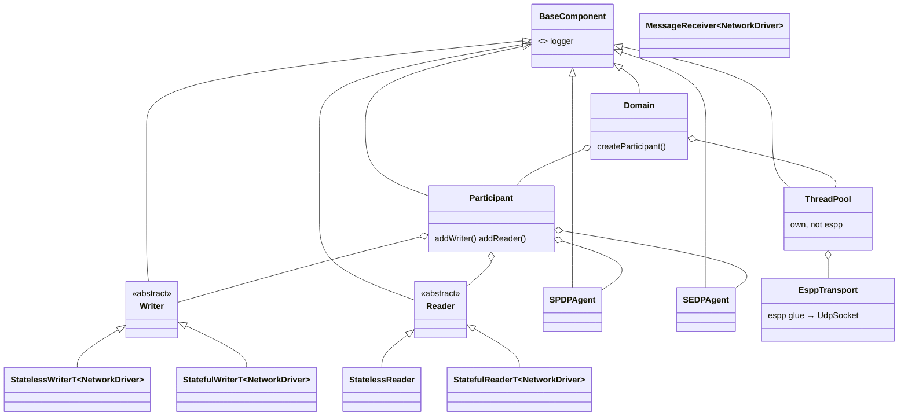
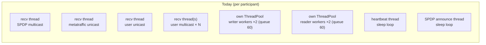
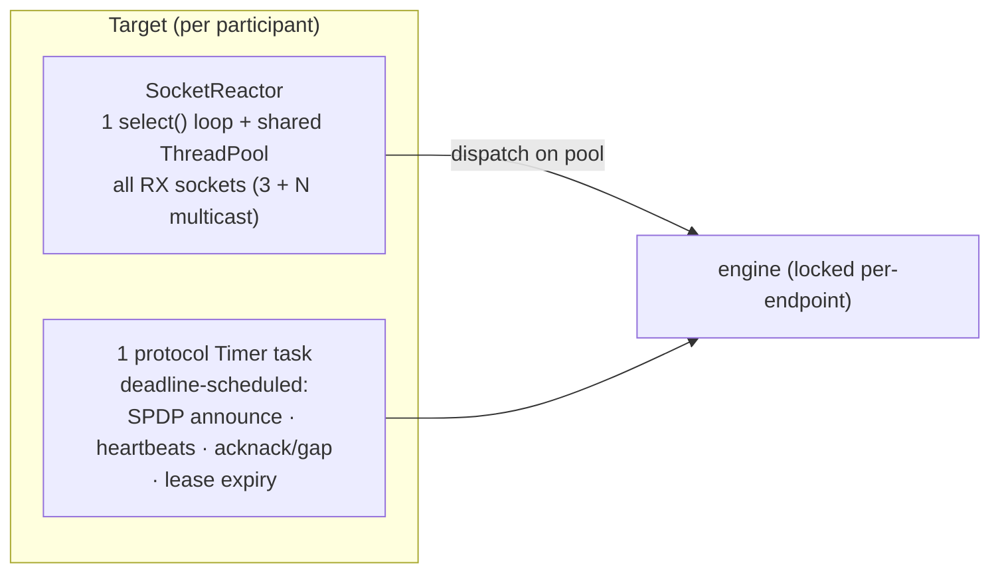
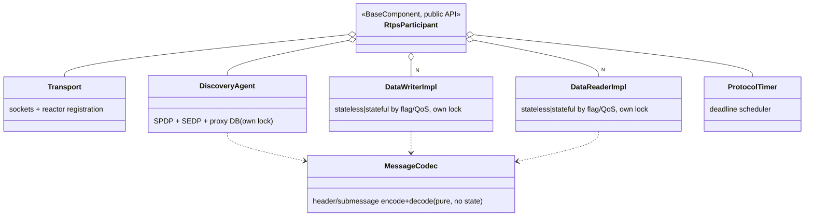
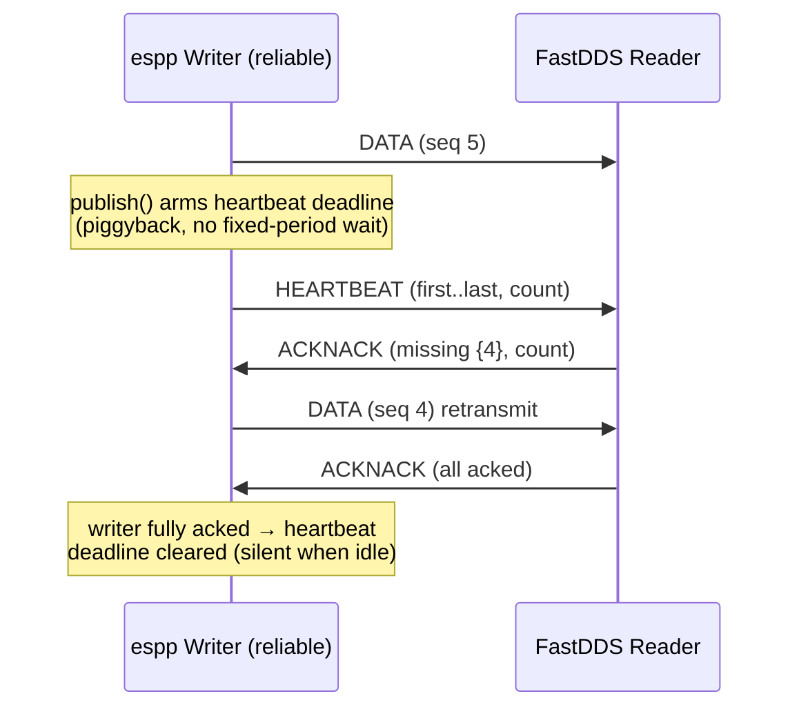

# RTPS Refactor: embeddedRTPS → an idiomatic espp component

Status: IN PROGRESS — Phases 0, 1, and 2 complete (see the git log on
feat/refactor-embedded-rtps for per-phase commits and their verification gates);
Phase 2b (Micro-CDR removal) running as a parallel exploration; next: Phase 3.

## 1. Context

espp currently carries **two** RTPS stacks:

| | `components/rtps_embedded` | `components/rtps` |
|---|---|---|
| Origin | Vendored **embeddedRTPS** (RWTH Aachen i11, MIT) + espp glue | espp-authored clean-room implementation |
| FastDDS / ROS 2 interop | **YES — the only one that works** | **No** (aspires to, never achieved) |
| LOC | ~9,850 (+ Micro-CDR submodule) | ~3,500 |
| Architecture | Deep template/virtual hierarchy, static pools, own ThreadPool | Single 86-method class, one 2,926-line TU |
| Serialization | Micro-CDR (submodule) | espp `cdr` + hand-rolled framing |
| Wired into host lib / python | No | Yes (`lib/espp.cmake`, `rtps_bindings.cpp`) |
| Host tests | `example/pc/host_pubsub.cpp` | `pc/tests/rtps_{pubsub,publisher,subscriber}.cpp` |

The **invariant this refactor must protect is FastDDS/ROS 2 interoperability**, and only
`rtps_embedded` has it. The native `rtps` component is itself the strongest evidence for
how this refactor must NOT be done: it is a from-scratch rewrite that replicated framing,
discovery messages, and reliable-QoS machinery — and still does not interop, because
interop lives in a long tail of wire-format and timing details that only survive by
*evolving* proven code under continuous interop testing. (Note: `components/rtps/README.md`
and `RELIABLE_RTPS_PLAN.md` overstate its status; they should be corrected or removed as
part of this work.)

**Strategy in one sentence:** keep embeddedRTPS's proven *protocol engine* (SPDP/SEDP,
stateful writer/reader state machines, wire codec), and progressively replace everything
*around* it — threading, transport, timing, memory policy, and the user-facing API — with
espp-idiomatic infrastructure, validating FastDDS/ROS 2 interop at every phase. The native
`rtps` component is frozen, mined for its (good) API shape, python-binding and test
patterns, and finally retired; the end state is a **single component named `rtps`** with
embeddedRTPS's engine and an espp-native surface.

## 2. Goals (from the request)

1. Follow the style/API idioms of other espp components.
2. Simplify the class hierarchy and implementation.
3. Leverage modern C++ (concepts; C++23 where it pays — see the decision point in §7).
4. Use the cross-platform espp components effectively (`base_component`, `task`, `timer`,
   `thread_pool`, `socket`/`socket_reactor`, `cdr`).
5. Improve memory and runtime efficiency of protocol work (heartbeats, announcements,
   buffers).

Non-goal: changing wire behavior. Every phase must leave FastDDS/ROS 2 interop green.

## 3. Current architecture (`rtps_embedded`)

### 3.1 Class hierarchy



Structural issues:
- **Template-on-`NetworkDriver`** threads through writers/readers/`MessageReceiver`,
  forcing `.tpp` template-implementation files and rebuilding the whole protocol per
  transport — but there is exactly one transport (`EsppTransport`). This buys nothing and
  costs compile time, debuggability, and readability.
- **Everything inherits `espp::BaseComponent`** (agents, pool, writers, readers). In espp
  the idiom is: the *user-facing component* is a `BaseComponent`; internal helpers take a
  `Logger&`/parent reference. A dozen loggers with independent tags/levels for one
  participant is noise.
- **Stateless/Stateful duplication** exists both as an inheritance axis and a template
  axis.

### 3.2 Threading & timing model



- Dedicated blocking-recv thread(s) per socket + embeddedRTPS's **own ThreadPool** (not
  espp's) with fixed workload queues; plus dedicated sleep-loop threads for heartbeats and
  SPDP announcements. Total: ~8+ threads/tasks with FreeRTOS stacks each.
- Heartbeats/announces are **time-driven only** — they fire on period regardless of
  whether any reliable reader is behind or any data is unacknowledged.

### 3.3 Memory model

- `config_esp32.hpp` compile-time caps: 5 stateless + 5 stateful writers/readers, 10
  endpoints/participant, 6 proxies, history 2/10, 64-char topic/type names, 10 UDP
  connections. Fixed `MemoryPool`/`ThreadSafeCircularBuffer` storage.
- Predictable footprint (good for embedded) but hard limits that a library user hits
  silently, and sized-for-worst-case even when idle.

### 3.4 What must NOT change (the interop surface)

The protocol state machines and wire encoding that demonstrably interop with FastDDS and
ROS 2: RTPS header/submessage encoding, SPDP/SEDP parameter lists and builtin-endpoint
sets, well-known port mapping, HEARTBEAT/ACKNACK/GAP semantics and timing tolerances,
GUID/EntityId conventions, and (for ROS 2) topic/type-name conventions (`rt/…`,
`…::msg::dds_::…_`). These move between files but their behavior is frozen by tests.

## 4. Target architecture

### 4.1 Component layout

One component, `components/rtps`, replacing both current components at the end state:

```
components/rtps/
  include/rtps.hpp              # public: RtpsParticipant facade (+ typed pub/sub)
  include/rtps_types.hpp        # Guid, Locator, QoS enums, discovery info structs
  include/detail/…              # engine headers (not part of the public API)
  src/participant.cpp           # facade
  src/engine/…                  # evolved embeddedRTPS core (concrete, de-templated)
  example/…                     # esp32 example (WiFi/Ethernet pub-sub with ROS 2 notes)
```

### 4.2 Public API (espp idioms)

Facade modeled on the (good) surface of the native component, per the espp canon:
`public BaseComponent`, nested `Config` with designated initializers, `std::function`
callback members, `bool` + logger error handling (the socket/protocol-family idiom),
`Task::BaseConfig` embedding, `\snippet`-wired docs.

```cpp
namespace espp {
class RtpsParticipant : public BaseComponent {
public:
  using sample_callback_t = std::function<void(std::span<const uint8_t> cdr_payload)>;
  using participant_discovered_callback_t = std::function<void(const ParticipantInfo &)>;
  using endpoint_discovered_callback_t = std::function<void(const EndpointInfo &)>;

  enum class Reliability { BEST_EFFORT, RELIABLE };

  struct WriterConfig {
    std::string topic;
    std::string type_name;
    Reliability reliability{Reliability::BEST_EFFORT};
    size_t history_depth{10};
    std::string multicast_group{};        ///< optional user multicast
  };
  struct ReaderConfig {
    std::string topic;
    std::string type_name;
    Reliability reliability{Reliability::BEST_EFFORT};
    sample_callback_t on_sample{nullptr};
  };
  struct Config {
    uint32_t domain_id{0};
    std::string interface_address{};      ///< "" → auto
    std::chrono::milliseconds announce_period{1000};
    std::chrono::milliseconds heartbeat_period{200};
    Limits limits{};                      ///< runtime capacity knobs (see §4.5)
    std::shared_ptr<SocketReactor> reactor{nullptr}; ///< share app-wide reactor; null → own
    Task::BaseConfig protocol_task_config{
        .name = "rtps", .stack_size_bytes = 6 * 1024, .priority = 10};
    participant_discovered_callback_t on_participant_discovered{nullptr};
    endpoint_discovered_callback_t on_endpoint_discovered{nullptr};
    Logger::Verbosity log_level{Logger::Verbosity::WARN};
  };

  explicit RtpsParticipant(const Config &config);
  bool start();
  void stop();
  bool is_started() const;

  // Untyped (wire-level) API — payload is a CDR-encapsulated sample:
  bool add_writer(const WriterConfig &config);
  bool add_reader(const ReaderConfig &config);
  bool publish(std::string_view topic, std::span<const uint8_t> cdr_payload);
};
} // namespace espp
```

### 4.3 Typed pub/sub via concepts (goal 3)

A thin, header-only layer on top of the span API, using espp `cdr` and a C++20 concept —
same pattern as `TouchDriverConcept`:

```cpp
namespace espp {
template <typename T>
concept CdrSerializable = requires(const T &ct, T &t, CdrWriter &w, CdrReader &r) {
  { ct.write_cdr(w) } -> std::same_as<bool>;
  { t.read_cdr(r) } -> std::same_as<bool>;
  { T::type_name() } -> std::convertible_to<std::string_view>; // e.g. "std_msgs::msg::dds_::UInt32_"
};

template <CdrSerializable T> class Publisher {
public:
  bool publish(const T &sample);   // serializes with a reused CdrWriter, calls participant
private:
  RtpsParticipant &participant_;
  std::string topic_;
  CdrWriter writer_;               // reused buffer — no per-publish allocation
};

template <CdrSerializable T> class Subscriber {
public:
  using callback_t = std::function<void(const T &)>;
  // wraps ReaderConfig::on_sample with CdrReader deserialization
};

// helpers for ROS 2 naming so interop stays turnkey:
namespace ros2 {
std::string topic_name(std::string_view ros_topic);   // "chatter" -> "rt/chatter"
} // namespace ros2
} // namespace espp
```

Rationale: keeps the engine byte-oriented (interop-neutral), gives users a clean typed
API, and makes the ROS 2 naming conventions a library helper instead of user folklore.

### 4.4 Threading model (goals 4 & 5)



- **All receive sockets → `SocketReactor`** (`UdpSocket::bind()` +
  `add_udp_receiver()`): 3+N blocking recv threads collapse into one select loop + the
  reactor's pool. `Config::reactor` lets an application share one reactor across RTPS,
  RTSP, etc. The reactor's one-shot arming preserves per-socket ordering (RTPS requires
  in-order processing per locator) while different sockets process concurrently.
- **embeddedRTPS's own ThreadPool is deleted**; dispatch uses the reactor's espp
  `ThreadPool`.
- **One protocol timer task replaces the heartbeat + SPDP threads**: a single
  `espp::Task` waiting (cv, drift-free absolute deadlines like `espp::Timer`) on the
  earliest of: next SPDP announce, next heartbeat *due*, pending acknack response delay,
  participant lease checks. Two threads → one, and it sleeps to the exact next deadline.
- **Event-driven heartbeat suppression** (goal 5, per RTPS spec 8.4.2.2): heartbeats are
  only scheduled while a reliable writer has unacknowledged changes for at least one
  matched reader; a publish on a reliable topic piggybacks/advances the heartbeat
  deadline instead of waiting for the period; a fully-acked writer goes silent. SPDP
  keeps its steady cadence (that one is supposed to be periodic).

### 4.5 Memory model (goal 5)

- **Static pools → runtime `Limits` in `Config`** with embedded-friendly defaults
  (allocated once at `start()`, not per-message):
  ```cpp
  struct Limits {
    size_t max_writers{8}, max_readers{8};
    size_t max_remote_participants{8}, max_remote_endpoints{32};
    size_t writer_history_depth{10}, reader_reorder_depth{32};
    size_t max_message_size{1400};        // fits one UDP MTU by default
  };
  ```
  Fixed-capacity behavior is preserved (reserve up front, refuse beyond limits with a
  logged error) — the *predictability* of embeddedRTPS without compile-time rebuild to
  change a cap.
- **Serialization buffer reuse**: per-writer and per-protocol-event scratch buffers
  (`CdrWriter`/message builder with `reset()`), and in-place submessage length patching
  instead of build-then-concatenate. Steady-state publish/heartbeat/announce paths do
  **zero heap allocations**.
- Optional allocator hook for PSRAM placement of histories on ESP32 targets.

### 4.6 Simplified hierarchy (goal 2)



- **De-template**: `NetworkDriver` template parameter removed everywhere; the transport is
  a concrete class. `.tpp` files fold into `.cpp`.
- **Inheritance collapses**: only `RtpsParticipant` is a `BaseComponent`. Engine classes
  are concrete, `final`, own their own mutex, and take `Logger&` (or a tagged child
  logger) by reference. The stateless/stateful split becomes either two concrete classes
  or one class with a reliability policy — decided during Phase 4 by whichever yields
  less duplication in the *proven* code (behavior-preserving transformation either way).
- **Locking**: today's cross-cutting mutexes become per-subobject locks with a documented
  one-way ordering (participant → agent/endpoint), eliminating the manual 8-lock contract.

### 4.7 Reliable exchange (behavior preserved, scheduling improved)



## 5. Migration plan (interop-gated phases)

Each phase is a separate PR, and **must pass the Phase 0 interop gate before merge**.

- **Phase 0 — Interop safety net (before any refactor, and before the Micro-CDR
  removal merges).**
  - Host-side interop harness: docker-compose with a FastDDS participant and a ROS 2
    (rmw_fastrtps) talker/listener; scripts assert bidirectional pub/sub with
    `rtps_embedded`'s host build (best-effort + reliable).
  - Golden wire tests: capture known-good SPDP/SEDP/DATA/HEARTBEAT/ACKNACK byte strings
    from the current (Micro-CDR-based) implementation; unit-test the codec against them
    byte-for-byte. Include the parameter-list corner cases a codec swap is most likely
    to break: string length-prefix + null terminator + 4-byte parameter alignment,
    PID_SENTINEL placement, locator encoding, GUID prefix ordering, SequenceNumberSet
    bitmaps, and the per-submessage endianness (E) flag.
  - CI job for the host harness; hardware smoke procedure documented for esp32.
- **Phase 1 — espp facade.** New `RtpsParticipant` facade (per §4.2) over the existing
  `Domain`/`Participant` engine. Python bindings + `pc/tests` ported to the facade
  (reusing the native component's binding/test patterns). No engine changes.
- **Phase 2 — Infrastructure swap.** Receive path → `SocketReactor`; embeddedRTPS
  ThreadPool deleted; heartbeat/SPDP threads → single deadline-scheduled protocol task;
  heartbeat suppression + publish piggyback. (Biggest efficiency win; engine state
  machines untouched.) Also fix unicast port allocation: today every process starts at
  participantId 0 and SO_REUSE lets a second process silently share the same unicast
  ports instead of bind-failing and probing to the next participantId (found in
  Phase 0c: two espp processes on one host cannot discover each other; the harness
  works around it by starting the espp side first — FastDDS probes past taken ports).
- **Phase 3 — De-templating & hierarchy collapse.** Remove `NetworkDriver` template,
  fold `.tpp`, concrete transport, `BaseComponent` only at the facade, per-subobject
  locks. Pure mechanical/behavior-preserving; golden tests + interop gate confirm.
- **Phase 4 — Memory model.** `Limits` runtime capacities replace `config_esp32.hpp`
  compile-time pools; scratch-buffer reuse; zero-alloc steady-state paths (verify with
  heap tracing on esp32).
- **Phase 2b (parallel track) — Micro-CDR removal.** Underway as a parallel
  exploration. Implement the §4.6 `MessageCodec` on espp `cdr` primitives plus a thin
  RTPS-framing layer (submessage headers, SequenceNumber/SNSet, PL_CDR parameter
  lists) and swap the engine's serialization call sites (message factory, SPDP/SEDP
  proxy-data encode/decode) over to it; then delete the Micro-CDR submodule.
  - **Salvage opportunity**: the native `rtps` component already contains exactly this
    layer (`ByteWriter`/`ByteReader`, `ParameterView`, the full PID table, and
    espp-`cdr`-based parameter-list building, ~500 LOC). Its end-to-end interop was
    never proven, but under Phase 0's golden byte tests the codec layer alone can be
    adopted safely — the one part of the native component worth transplanting.
  - **Gating**: must not merge before Phase 0's golden tests exist — a codec swap is
    precisely the class of change that breaks interop silently (alignment, sentinels,
    endianness flags).
  - **Sequencing**: independent of Phases 1–2 (different layers: API/infra vs codec) so
    it can proceed in parallel with them, but it touches the same engine files as
    Phase 3's de-templating — land it *before* Phase 3 (preferred; the fold-in then
    happens with the final codec in place) rather than concurrently.
- **Phase 5 — Typed API + ROS 2 helpers.** `CdrSerializable` concept,
  `Publisher<T>`/`Subscriber<T>`, `ros2::topic_name/type helpers`; espp `cdr` for user
  payloads — after Phase 2b, facade and engine share one serialization stack.
- **Phase 6 — Consolidation.** The refactored component takes the `rtps` name; the old
  native implementation and `rtps_embedded` are removed (the Micro-CDR submodule goes
  with Phase 2b); `lib/espp.cmake`, python bindings, Doxyfile, build.yml,
  upload_components entries updated; stale docs (`components/rtps/README.md`,
  `RELIABLE_RTPS_PLAN.md`) deleted or archived into this doc's history section.

## 6. Verification

- **Interop matrix (the gate)**: espp↔espp (host loopback, esp32↔host), espp↔FastDDS
  (both directions, best-effort + reliable), espp↔ROS 2 via rmw_fastrtps (`ros2 topic
  echo` of an espp publisher; espp subscriber on a `ros2 topic pub`).
- Golden wire-format unit tests (codec byte-exactness).
- `pc/tests/*.cpp` style host tests (existing precedent) + python tests for bindings.
- esp32 measurements per phase: task count, stack usage, heap high-water mark, steady
  state allocations (should reach 0 in Phase 4), CPU% at fixed pub rate, and idle network
  silence when fully acked (Phase 2).

## 7. Decision points

1. **C++ standard — DECIDED: C++20.** Repo canon (host lib pins `cxx_std_20`; MSVC
   wheels). Concepts/`span`/`requires` are established precedent and cover the goals. A
   repo-wide C++23 bump can be revisited later as its own PR; the API in §4.2 does not
   depend on it (bool+logger is the espp protocol-family idiom).
2. **Stateless/stateful merge shape** (two classes vs policy flag) — defer to Phase 4
   evidence.
3. **Micro-CDR retirement — DECIDED: yes, as parallel track Phase 2b** (exploration
   already underway). Gated on Phase 0 golden tests; land before Phase 3. See §5.
4. **QoS surface — DECIDED: only today's proven QoS** (reliability, history depth,
   multicast). Additional DDS QoS policies are added only alongside interop tests that
   prove them against FastDDS/ROS 2.

## 8. Risks

| Risk | Mitigation |
|---|---|
| Interop regression during refactor | Phase 0 harness gates every PR; golden byte tests |
| Reactor changes RX ordering/timing | One-shot arming preserves per-socket ordering; heartbeat/acknack tolerances covered by interop reliable tests |
| Runtime limits regress embedded predictability | `Limits` reserved at `start()`; no steady-state allocation (verified by heap trace) |
| De-templating introduces subtle behavior drift | Purely mechanical phases isolated in their own PRs; golden tests byte-exact |
| Upstream embeddedRTPS divergence | We already diverged (espp glue, fixes); this refactor formalizes the fork — record provenance + license attribution in headers |
