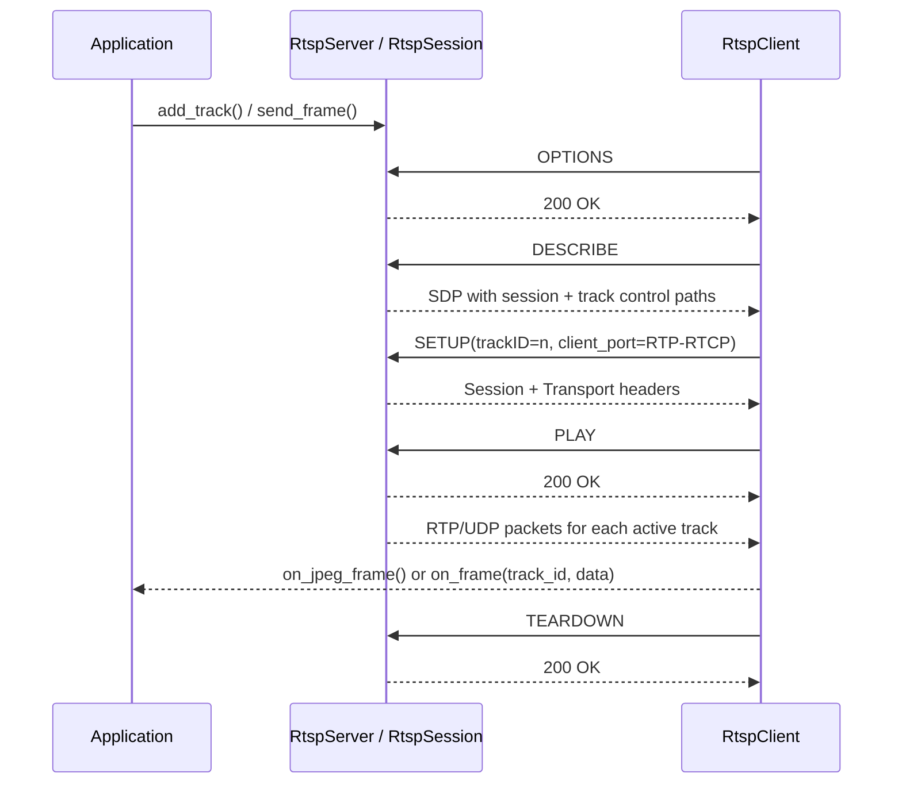
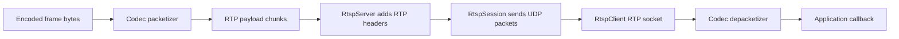

# RTSP (Real-Time Streaming Protocol) Component

The `rtsp` component provides a flexible, multi-codec RTSP streaming framework
for ESP32 devices. It supports MJPEG, H.264, and generic audio codecs through
an extensible packetizer/depacketizer architecture. The component handles only
RTP packet splitting and reassembly — encoding and decoding of media data is
performed externally.

<!-- markdown-toc start - Don't edit this section. Run M-x markdown-toc-refresh-toc -->
**Table of Contents**

- [RTSP (Real-Time Streaming Protocol) Component](#rtsp-real-time-streaming-protocol-component)
  - [How RTSP Works](#how-rtsp-works)
  - [Packetization Pipeline](#packetization-pipeline)
  - [RTSP Client](#rtsp-client)
  - [RTSP Server](#rtsp-server)
  - [Packetizers and Depacketizers](#packetizers-and-depacketizers)
  - [Testing and Utilities](#testing-and-utilities)
  - [Example](#example)

<!-- markdown-toc end -->

## How RTSP Works

The component uses a split control-plane / media-plane design:

- **RTSP over TCP** handles session control such as `OPTIONS`, `DESCRIBE`,
  `SETUP`, `PLAY`, `PAUSE`, and `TEARDOWN`.
- **SDP** returned from `DESCRIBE` tells the client what tracks exist, how
  they are encoded, and which per-track control URLs must be used for
  `SETUP`.
- **RTP/UDP** carries encoded media packets after playback starts.
- **RTCP/UDP** sockets are created alongside RTP sockets, but the current ESPP
  implementation keeps RTCP support lightweight and does not yet implement a
  full control/feedback plane.

In ESPP, the server generates one SDP description per session, with one
`m=...` section and one `a=control:.../trackID=N` entry per registered
track. The client parses those lines during `describe()` and then issues
`SETUP` once per discovered track before calling `PLAY`.

## Packetization Pipeline

The codec-specific logic is intentionally separated from the RTSP core:

`RtspServer::send_frame(track_id, data)` asks the selected packetizer to split
the encoded frame into MTU-sized chunks, adds RTP headers with track-specific
SSRC and sequence numbers, and leaves the resulting packets queued for active
sessions to transmit. On the client side, `RtspClient::handle_rtp_packet()`
parses the RTP header, uses the payload type to find the matching depacketizer,
and emits a completed frame through either `on_jpeg_frame` or the generic
`on_frame(track_id, data)` callback.

## RTSP Client

The `RtspClient` class connects to an RTSP server and receives media streams
over RTP/UDP. It dispatches incoming RTP packets to codec-specific
depacketizers based on payload type.

For **backward compatibility**, setting the `on_jpeg_frame` callback
automatically creates an `MjpegDepacketizer` for MJPEG streams (payload type
26). For generic multi-track use, applications can use the `on_frame`
callback and inspect parsed SDP metadata through `tracks()`.

The client supports:

* generic `on_frame(track_id, data)` callbacks for multi-track sessions
* parsed SDP track metadata including media type, payload type, codec name,
  sample rate, channel count, and resolved control path
* automatic depacketizer selection for MJPEG, H.264, and generic payloads
  discovered during `DESCRIBE`
* an `on_connection_lost` callback for reconnect / rediscovery workflows when
  the RTSP control socket or RTP stream disappears after playback starts
* custom depacketizers via `add_depacketizer()` for additional payload types

## RTSP Server

The `RtspServer` class accepts RTSP connections and streams media over RTP/UDP.
It supports multiple media tracks, each with its own codec-specific packetizer,
SSRC, and sequence numbering.

For **backward compatibility**, calling `send_frame(const JpegFrame&)` lazily
creates a default MJPEG track. For other codecs, register tracks via
`add_track()` and send frames with `send_frame(track_id, data)`.

The server also exposes helpers that are useful for embedded capture loops:

* configurable accept, session-dispatch, and per-session control task stack
  sizes
* `has_active_sessions()` to avoid capturing when no client is actively playing
* `get_capture_cooldown()` and `get_recommended_capture_period()` so an
  application can slow capture when RTP backpressure is observed
* a legacy MJPEG `send_frame(std::span<const uint8_t>)` path that preserves the
  older wire format for existing MJPEG-only users

## Packetizers and Depacketizers

The packetizer/depacketizer abstraction allows the server and client to support
multiple media codecs without changing the RTSP core:

- **MJPEG** (`MjpegPacketizer` / `MjpegDepacketizer`) — RFC 2435 JPEG over RTP
- **H.264** (`H264Packetizer` / `H264Depacketizer`) — RFC 6184 with FU-A fragmentation
- **Generic** (`GenericPacketizer` / `GenericDepacketizer`) — MTU chunking for
  audio or other pre-encoded payloads, with frame reconstruction based on RTP
  marker / timestamp boundaries

Custom packetizers can be created by subclassing `RtpPacketizer` or
`RtpDepacketizer`.

## Testing and Utilities

There are several ways to exercise the RTSP stack:

* **ESPP Python library**: build the host library from
  [`lib`](https://github.com/esp-cpp/espp/tree/main/lib) with `./build.sh` to
  expose the RTSP client/server classes to Python.
* **Python harness scripts**:
  [`python`](https://github.com/esp-cpp/espp/tree/main/python) contains wrapper
  and multi-track scripts for exercising legacy MJPEG flows, generic multi-track
  flows, live microphone audio, and end-to-end host validation.
* **Embedded examples and downstream apps**: the component example plus
  [`camera-streamer`](https://github.com/esp-cpp/camera-streamer) and
  [`camera-display`](https://github.com/esp-cpp/camera-display) cover practical
  server/client integrations.

See [`python/README.md`](../../python/README.md) for more information on the
host-side scripts.

## Example

The [example](./example) demonstrates several RTSP usage patterns selected via
menuconfig, including:

* legacy MJPEG server + client behavior on the same device
* server-only MJPEG streaming
* client-only MJPEG reception from a remote RTSP server
* startup API tests for packetizers, depacketizers, and server/client setup
* multi-track streaming with MJPEG video plus generic audio

For more complete example use, see the
[camera-streamer](https://github.com/esp-cpp/camera-streamer) and
[camera-display](https://github.com/esp-cpp/camera-display) repositories.
